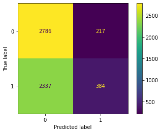
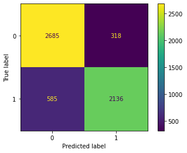

# News Headlines Dataset For Sarcasm Detection

## Dataset
This [News Headlines dataset](https://www.kaggle.com/datasets/rmisra/news-headlines-dataset-for-sarcasm-detection) for Sarcasm Detection is collected from two news website. [TheOnion](https://www.theonion.com/) aims at producing sarcastic versions of current events and we collected all the headlines from News in Brief and News in Photos categories (which are sarcastic). We collect real (and non-sarcastic) news headlines from [HuffPost](https://www.huffingtonpost.com/).

## EDA
- head
- tail

## Cleaning
- Drop useless column
- Tokenizer
    - Set VOCAB_SIZE
    - Fit tokenizer on texts
    - Convert texts to sequences
- Find maximum length of sequences
- Set MAX_LEN
- Padding 

## Train Test Split
Test size: 20%

## Simple Neural Network 
- Architecture
    1. Input
    2. Dense
    3. Dense
    4. Dense
- Accuracy of model (weighted-averaged F1 score): **55%**

 

## Complicated Neural Network
- Architecture
    1. Embedding
    2. Conv1D
    3. MaxPooling1D
    4. Dropout
    5. Flatten
    6. Dense
    7. Dense
- Accuracy of model (weighted-averaged F1 score): **84%**

 

